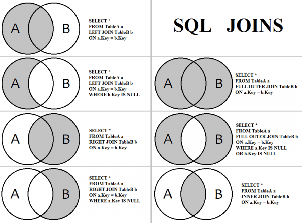

# PSET 2

### Aluno: Eduardo Moisés Martins

### Turma: CC1M

### Profesor: Abrantes Araújo Silva Filho

### Monitor: Suellen Miranda Amorim 

Desenvolvi este Pset no SGBD PostgreSQL através do DBeaver.
___

### QUESTÃO 01: 
Prepare um relatório que mostre a média salarial dos funcionários
de cada departamento.

> Sempre após ler o que a questão pede, eu mentalizo como deve ficar a
tabela e depois os caminhos que me levam até o resultado esperado. 

	SELECT nome_departamento,
		AVG(salario) AS media_salarial
	FROM departamento, funcionario
	WHERE departamento.numero_departamento = funcionario.numero_departamento 
	GROUP BY nome_departamento
	ORDER BY nome_departamento
	;

> Selecionei (SELECT) quais colunas eu quero e de onde (FROM) elas 
estão originalmente, coloquei uma condição (WHERE) para que não 
duplicasse os dados, agrupei (GROUP BY) pelo nome do departamento para 
cada nome_departamento distinto que existe me retornasse a sua 
respectiva média salárial e ordernei (ORDER BY) pelo 
nome_departamento para ficasse em ordem alfabética.

   
 ___

### QUESTÃO 02: 
Prepare um relatório que mostre a média salarial dos homens e das
mulheres.

	SELECT AVG(funcionario.salario) AS media_salarial, funcionario.sexo
	FROM funcionario
	GROUP BY funcionario.sexo
	;

> Selecionei (SELECT) as colunas que eu gostaria que aparecessem e de 
onde (FROM) elas estão originalmente, nesse caso uma única tabela, e 
agrupei (GROUB BY) pelo sexo para que cada sexo distinto tenha uma 
média salarial.

___

### QUESTÃO 03: 
Prepare um relatório que liste o nome dos departamentos e, para
cada departamento, inclua as seguintes informações de seus funcionários: o nome
completo, a data de nascimento, a idade em anos completos e o salário.

	SELECT nome_departamento, 
		CONCAT(primeiro_nome, ' ', nome_meio, ' ',  ultimo_nome) AS nome_completo, 
		data_nascimento, 
		EXTRACT(YEAR FROM AGE(funcionario.data_nascimento)) AS idade, 
		salario
	FROM departamento, funcionario
	WHERE departamento.numero_departamento = funcionario.numero_departamento 
	ORDER BY nome_departamento, 
		nome_completo
	;

> Selecionei (SELECT) as colunas que eu gostaria que aparecessem, nessa
questão tive que pesquisar o "CONCAT" para juntar colunas em uma só e
o "EXTRACT", que foi mais difícil de achar, para calcular a idade e de
onde elas estão originalmente, com uma condição (WHERE) para não 
duplicar os itens e ordenei (ORDER BY) em ordem alfabética, primeiro 
o departamento e depois o nome do funcionário em hierárquia.

___

### QUESTÃO 04: 
Prepare um relatório que mostre o nome completo dos funcionários, a idade em anos completos, 
o salário atual e o salário com um reajuste que obedece ao seguinte critério: se o salário
atual do funcionário é inferior a 35.000 o reajuste deve ser de 20%, e se o salário atual 
do funcionário for igual ou superior a 35.000 o reajuste deve ser de 15%.

	SELECT CONCAT(primeiro_nome, ' ', nome_meio, ' ', ultimo_nome) AS nome_completo,
		EXTRACT(YEAR FROM AGE(funcionario.data_nascimento)) AS idade,
		salario,
		CASE WHEN salario < 35000 THEN salario * 1.2 
			ELSE salario * 1.15
		END AS reajuste 
	FROM funcionario
	ORDER BY nome_completo
	;

> Selecionei (SELECT) as colunas necessárias, aqui usei "CASE" para 
fazer os cálculos e ele funciona semelhante ao "IF" e "ELSE" do JS,
e de onde estavam as colunas originalmente e ordenei  (ORDER BY) em 
ordem alfabética pelo nome.

___

### QUESTÃO 05: 
Prepare um relatório que liste, para cada departamento, o nome
do gerente e o nome dos funcionários. Ordene esse relatório por 
nome do departamento (em ordem crescente) e por salário dos funcionários (em ordem decrescente).

	SELECT nome_departamento, 
		CASE WHEN funcionario.cpf = departamento.cpf_gerente THEN 'gerente'
			ELSE 'funcionario'
		END AS cargo,
		CONCAT(primeiro_nome, ' ', nome_meio, ' ', ultimo_nome) AS nome,
		salario
	FROM departamento, funcionario
	WHERE departamento.numero_departamento = funcionario.numero_departamento 
	ORDER BY nome_departamento, 
		salario DESC
	;

> Selecionei (SELECT) as colunas necessárias, como nessa questão pedia 
para identificar se a pessoa era gerente ou não, criei uma nova coluna
chamada "cargo" a qual se o cpf da pessoa estivesse na tabela departamento 
como gerente então ela seria gerente em cargo, se não funcionário, e de 
onde (FROM) elas estavam originalmente, com a condição (WHERE) para não 
duplicar os dados e ordenei (ORDER BY) alfabética pelo nome e o salário 
em ordem decrescente.

___

### QUESTÃO 06: 
Prepare um relatório que mostre o nome completo dos funcionários que têm dependentes, 
o departamento onde eles trabalham e, para cada funcionário, 
também liste o nome completo dos dependentes, a idade em anos de cada
dependente e o sexo (o sexo NÃO DEVE aparecer como M ou F, deve aparecer
como “Masculino” ou “Feminino”).

	SELECT CASE WHEN funcionario.cpf = dependente.cpf_funcionario 
			THEN concat(funcionario.primeiro_nome, ' ', funcionario.nome_meio, ' ', funcionario.ultimo_nome)
		END AS nome_completo,
		nome_departamento,
		nome_dependente,
		EXTRACT(YEAR FROM AGE(dependente.data_nascimento)) AS idade,
		CASE WHEN dependente.sexo = 'M' THEN 'masculino'
			ELSE 'feminino'
		END AS sexo
	FROM dependente, funcionario, departamento
	WHERE funcionario.cpf = dependente.cpf_funcionario 
		AND funcionario.numero_departamento = departamento.numero_departamento
	ORDER BY nome_departamento, nome_completo, idade DESC
	;

> Selecionei (SELECT) as colunas necessárias e de onde (FROM) elas estavam
originalmente, com duas condições (WHERE) para não duplicar os dados e
ordedei (ORDER BY) alfabéticamente pelo nome do departamento, nome da 
pessoa e pela idade decrescente.

___

### QUESTÃO 07: 
Prepare um relatório que mostre, para cada funcionário que NÃO
TEM dependente, seu nome completo, departamento e salário.

	SELECT CONCAT(primeiro_nome, ' ', nome_meio, ' ', ultimo_nome) AS nome_completo,
		nome_departamento,
		salario
	FROM departamento, funcionario 
	LEFT JOIN dependente
		ON funcionario.cpf = dependente.cpf_funcionario
	WHERE dependente.cpf_funcionario IS NULL
		AND funcionario.numero_departamento = departamento.numero_departamento
	ORDER BY nome_departamento, salario DESC
	;

> Selecionei (SELECT) as colunas solicitadas e de onde elas estavam originalmente,
e fiz uma junção com outra tabela para pegar parte dos dados dela (LEFT JOIN), 
com duas condições (WHERE) para não duplicar e pegar somente os dados 
solcitados e ordenei (ORDER BY), alfabéticamente, pelo nome do departamento 
e pelo maior para o menor salário.

> Encontrei uma tabela na internet explicando os joins por diagramas e mostrando 
um script para cada join.

___

### QUESTÃO 08: 
Prepare um relatório que mostre, para cada departamento, os projetos desse departamento e o 
nome completo dos funcionários que estão alocados em cada projeto. Além disso inclua o
número de horas trabalhadas por cada funcionário, em cada projeto.

	SELECT nome_departamento,
		nome_projeto,
		CONCAT(primeiro_nome, ' ', nome_meio, ' ', ultimo_nome) AS nome_completo,
		horas
	FROM departamento, projeto, funcionario, trabalha_em
	WHERE departamento.numero_departamento = projeto.numero_departamento 
		AND funcionario.cpf = trabalha_em.cpf_funcionario 
		AND projeto.numero_projeto = trabalha_em.numero_projeto
	ORDER BY nome_departamento, nome_projeto
	;

> Selecionei (SELECT) as colunas solicitadas e de onde (FROM) elas são 
originalmente, com 3 condições (WHERE) para que não duplicasse os dados 
e que desse o resultado desejado e ordenei (ORDER BY) pelo nome do departamento 
e o nome do projeto, alfabéticamente.

___

### QUESTÃO 09: 
Prepare um relatório que mostre a soma total das horas de cada
projeto em cada departamento. Obs.: o relatório deve exibir o nome do departamento, 
o nome do projeto e a soma total das horas.

	SELECT nome_departamento,
		nome_projeto,
		SUM(horas) AS total_horas
	FROM departamento, projeto, trabalha_em 
	WHERE departamento.numero_departamento = projeto.numero_departamento
		AND projeto.numero_projeto = trabalha_em.numero_projeto
	GROUP BY nome_departamento, nome_projeto 
	ORDER BY nome_departamento
	;

> Selecionei (SELECT) as colunas desejadas, aqui usei "SUM" para fazer o 
somatório das horas e de onde (FROM) elas são, com duas condições (WHERE) 
para não repetir os dados, agrupei (GROUP BY) pelo nome do departamento e do 
projeto para que em cada projeto de cada departamento calculasse o total de
horas que foram trabalhadas e documentadas e ordenei (ORDER BY) pelo nome 
do departamento.

___

### QUESTÃO 10: 
Prepare um relatório que mostre a média salarial dos funcionários
de cada departamento.

	SELECT nome_departamento,
		AVG(salario) AS media_salarial
	FROM departamento, funcionario
	WHERE departamento.numero_departamento = funcionario.numero_departamento 
	GROUP BY nome_departamento
	ORDER BY nome_departamento
	;

> Percebi que essa questão é idêntica a 1° questão então fiz exatamente 
o mesmo procedimento.

___

### QUESTÃO 11: 
Considerando que o valor pago por hora trabalhada em um projeto é de 50 reais, 
prepare um relatório que mostre o nome completo do funcionário, o nome do projeto 
e o valor total que o funcionário receberá referente às horas trabalhadas naquele projeto.

	SELECT CONCAT(primeiro_nome, ' ', nome_meio, ' ', ultimo_nome) AS nome_completo,
		nome_projeto,
		horas*50 AS salario_50_por_h
	FROM funcionario, projeto, trabalha_em 
	WHERE projeto.numero_projeto = trabalha_em.numero_projeto
		AND funcionario.cpf = trabalha_em.cpf_funcionario 
	ORDER BY nome_projeto
	;

> Selecionei (SELECT) as colunas solicitadas, as quais em uma multipliquei os dados 
da coluna trabalha_em.horas por 50, para que estimasse quanto seria o 
salario de cada funcionário em cada projeto considerando que por 1 hora
trabalhada ganhasse R$50,00 e apelidei essa coluna de "salario_50_por_h",
de onde estavam originalmente, com duas condições (WHERE) para não repetisse os 
dados e ordenei (ORDER BY) pelo nome do projeto.

___

### QUESTÃO 12: 
Seu chefe está verificando as horas trabalhadas pelos funcionários nos projetos e 
percebeu que alguns funcionários, mesmo estando alocadas à algum projeto, não 
registraram nenhuma hora trabalhada. Sua tarefa é preparar um relatório que liste 
o nome do departamento, o nome do projeto e o nome dos funcionários que, mesmo 
estando alocados a algum projeto, não registraram nenhuma hora trabalhada.

	SELECT nome_departamento,
		nome_projeto,
		CONCAT(primeiro_nome, ' ', nome_meio, ' ',ultimo_nome) AS nome_completo
	FROM departamento, projeto, trabalha_em, funcionario
	WHERE departamento.numero_departamento = projeto.numero_departamento 
		AND departamento.numero_departamento = funcionario.numero_departamento 
		AND projeto.numero_projeto = trabalha_em.numero_projeto 
		AND funcionario.cpf = trabalha_em.cpf_funcionario 
		AND trabalha_em.horas = 0 
	GROUP BY nome_completo, nome_departamento, nome_projeto
	;

> Selecionei (SELECT) as colunas necessárias e de onde (FROM) elas são, 
com 5 condições (WHERE) distintas para não repetir os dados e retornasse o resultado 
desejado e agrupei (GROUP BY) pelo nome, nome do departamento e o nome 
do projeto a fim de dar o resultado desejado.

___

### QUESTÃO 13: 
Durante o natal deste ano a empresa irá presentear todos os funcionários e todos os 
dependentes (sim, a empresa vai dar um presente para cada funcionário e um presente 
para cada dependente de cada funcionário) e pediu para que você preparasse um relatório 
que listasse o nome completo das pessoas a serem presenteadas (funcionários e dependentes), 
o sexo e a idade em anos completos (para poder comprar um presente adequado). Esse relatório
deve estar ordenado pela idade em anos completos, de forma decrescente.

	SELECT CONCAT(primeiro_nome, ' ', nome_meio, ' ', ultimo_nome) AS nome_completo,
		sexo,
		EXTRACT(YEAR FROM AGE(data_nascimento)) AS idade
	FROM funcionario
	UNION ALL
	SELECT nome_dependente AS nome_completo,
		sexo,
		EXTRACT(YEAR FROM AGE(data_nascimento)) AS idade
	FROM dependente 
	ORDER BY idade DESC
	;

> Como em uma única busca não conseguiria chegar no resultado, tive que
unir duas tabelas com todos os resultados (UNION ALL) para não deixar 
nenhuma pessoa de fora. Inicialmente selecionei (SELECT) as colunas 
necessárias, dos funcionários, e de onde elas são (FROM) e uni com 
as colunas selecionadas (SELECT) dos dependentes e de onde elas são 
(FROM) e ordenei (ORDER BY) pela idade de forma decrescente. 
OBS: todas as colunas do 1° e do 2° "SELECT" tiveram os mesmos apelidos 
para não dar conflito.

> Como na vida real o filho(a) pode ter os sobrenomes da mãe e do pai mas 
também pode ter o sobrenome de só um dos dois, acabei optanto por deixar os 
dependentes sem sobrenome, mas se fosse para colocar com eu utilizaria o "CONCAT" 
e uniria o nome do dependente com o nome do meio e ultimo nome do funcionário ao qual 
ele é dependente.

___

### QUESTÃO 14: 
Prepare um relatório que exiba quantos funcionários cada departamento tem.

	SELECT nome_departamento,
		COUNT(funcionario.cpf) AS numero_funcionario
	FROM departamento, funcionario 
	WHERE departamento.numero_departamento = funcionario.numero_departamento
	GROUP BY departamento.numero_departamento
	ORDER BY nome_departamento
	;

> Selecionei (SELECT) nas colunas solicitadas, a qual uma usei "COUNT" 
para somar o número de funcionários em cada departamento, e de onde 
eram (FROM) essas colunas e dados originalmente, agrupei (GROUP BY) pelo 
nome do departamento a fim de cada departamento distinto fizesse a soma
dos funcionários alucados neles e ordenei (ORDER BY) pelo nome do departamento.

___

### QUESTÃO 15: 
Como um funcionário pode estar alocado em mais de um projeto,
prepare um relatório que exiba o nome completo do funcionário, o departamento
desse funcionário e o nome dos projetos em que cada funcionário está alocado.
Atenção: se houver algum funcionário que não está alocado em nenhum projeto,
o nome completo e o departamento também devem aparecer no relatório.

> **OBS: Como não existe nenhum funcionário sem projeto no banco de dados do Elmasri, adicionei um funcionário 
na tabela funcionario e não coloquei ele em nenhum projeto, logo não está na tabela trabalha_em.**

	INSERT INTO elmasri.funcionario VALUES
	(11122233344, 'Eduardo', 'M', 'Martins', '2003-04-04', 'Rua Floriano Kiefer, 41, Vila Velha, ES', 'M', 20000, 88866555576, 1);

> Após adicionar um funcionário sem projeto consigo provar e testar se o 
script me retorna o que eu desejo.

	SELECT CONCAT(primeiro_nome, ' ', nome_meio, ' ', ultimo_nome) AS nome_completo,
		nome_departamento,
		nome_projeto
	FROM funcionario, departamento, projeto, trabalha_em 
	WHERE funcionario.numero_departamento = departamento.numero_departamento 
		AND projeto.numero_projeto = trabalha_em.numero_projeto 
		AND funcionario.cpf = trabalha_em.cpf_funcionario
	UNION (
	SELECT CONCAT(primeiro_nome, ' ', nome_meio, ' ', ultimo_nome) AS nome_completo,
		nome_departamento,
		CASE WHEN nome_projeto = null THEN 'null' END AS nome_projeto
	FROM funcionario, trabalha_em, departamento, projeto 
	WHERE funcionario.cpf <> trabalha_em.cpf_funcionario
		AND funcionario.numero_departamento = departamento.numero_departamento 
	GROUP BY nome_completo, nome_departamento, nome_projeto 
	EXCEPT
	SELECT CONCAT(primeiro_nome, ' ', nome_meio, ' ', ultimo_nome) AS nome_completo,
		nome_departamento,
		CASE WHEN nome_projeto = null THEN 'null' END AS nome_projeto
	FROM funcionario, trabalha_em, departamento, projeto 
	WHERE funcionario.cpf = trabalha_em.cpf_funcionario
	GROUP BY nome_completo, nome_departamento, nome_projeto
	) 
	ORDER BY nome_departamento, nome_completo, nome_projeto 
	;
> O único caminho que encontrei foi selecionando (SELECT) as colunas com os dados
dos funcionários que estão alocados em algum projeto e somando (UNION) com os que 
não estão alocados em nenhum projeto. E a única forma que encontrei de selecionar
somente os que não estão alocados em nenhum projeto foi usando a cláusula "EXCEPT",
no caso selecionava todos os funcionários e todos os que estão alocados em algum 
projeto e me retornava o que não estava alocado em nenhum projeto. 
Quando estava testando fiz somente selecionando os nomes e quando consegui o resultado 
com somente o funcionário que estava sem projeto coloquei o resto das colunas no 
"SELECT", "FROM" e "GROUP BY". 

> Nessa questão demorei bastante para conseguir concluir 100% e ter certeza de entregar 
o que foi pedido, não consegui explicar exatamente de uma forma coerente mas eu consegui
fazer e foi gratificante ter conseguido o resultado que eu gostaria.

___
Essas foram as minhas respostas desse pset.
