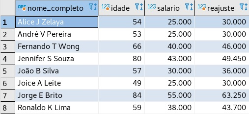

# PSET 2

### Aluno: Eduardo Moisés Martins

### Profesor: Abrantes Araújo Silva Filho

### Monitor: Suellen Miranda Amorim 

Desenvolvi este Pset no SGBD PostgreSQL através do DBeaver.
___

### QUESTÃO 01: 
Prepare um relatório que mostre a média salarial dos funcionários
de cada departamento.

	SELECT nome_departamento,
		AVG(salario) AS media_salarial
	FROM departamento, funcionario
	WHERE departamento.numero_departamento = funcionario.numero_departamento 
	GROUP BY nome_departamento
	ORDER BY nome_departamento
	;

  
___

### QUESTÃO 02: 
Prepare um relatório que mostre a média salarial dos homens e das
mulheres.

	SELECT AVG(funcionario.salario) AS media_salarial, funcionario.sexo
	FROM funcionario
	GROUP BY funcionario.sexo
	;

___

### QUESTÃO 03: 
Prepare um relatório que liste o nome dos departamentos e, para
cada departamento, inclua as seguintes informações de seus funcionários: o nome
completo, a data de nascimento, a idade em anos completos e o salário.

	SELECT nome_departamento, 
		CONCAT(primeiro_nome, ' ', nome_meio, ' ',  ultimo_nome) AS nome_completo, 
		data_nascimento, 
		EXTRACT(YEAR FROM AGE(funcionario.data_nascimento)) AS idade, 
		salario
	FROM departamento, funcionario
	WHERE departamento.numero_departamento = funcionario.numero_departamento 
	ORDER BY nome_departamento, 
		nome_completo
	;
	

___

### QUESTÃO 04: 
Prepare um relatório que mostre o nome completo dos funcionários, a idade em anos completos, 
o salário atual e o salário com um reajuste que obedece ao seguinte critério: se o salário
atual do funcionário é inferior a 35.000 o reajuste deve ser de 20%, e se o salário atual 
do funcionário for igual ou superior a 35.000 o reajuste deve ser de 15%.

	SELECT CONCAT(primeiro_nome, ' ', nome_meio, ' ', ultimo_nome) AS nome_completo,
		EXTRACT(YEAR FROM AGE(funcionario.data_nascimento)) AS idade,
		salario,
		CASE WHEN salario < 35000 THEN salario * 1.2 
			ELSE salario * 1.15
		END AS reajuste 
	FROM funcionario
	ORDER BY nome_completo
	;

___

### QUESTÃO 05: 
Prepare um relatório que liste, para cada departamento, o nome
do gerente e o nome dos funcionários. Ordene esse relatório por 
nome do departamento (em ordem crescente) e por salário dos funcionários (em ordem decrescente).

	SELECT nome_departamento, 
		CASE WHEN funcionario.cpf = departamento.cpf_gerente THEN 'gerente'
			ELSE 'funcionario'
		END AS cargo,
		CONCAT(primeiro_nome, ' ', nome_meio, ' ', ultimo_nome) AS nome,
		salario
	FROM departamento, funcionario
	WHERE departamento.numero_departamento = funcionario.numero_departamento 
	ORDER BY nome_departamento, 
		salario DESC
	;

___

### QUESTÃO 06: 
Prepare um relatório que mostre o nome completo dos funcionários que têm dependentes, 
o departamento onde eles trabalham e, para cada funcionário, 
também liste o nome completo dos dependentes, a idade em anos de cada
dependente e o sexo (o sexo NÃO DEVE aparecer como M ou F, deve aparecer
como “Masculino” ou “Feminino”).

	SELECT CASE WHEN funcionario.cpf = dependente.cpf_funcionario 
			THEN concat(funcionario.primeiro_nome, ' ', funcionario.nome_meio, ' ', funcionario.ultimo_nome)
		END AS nome_completo,
		nome_departamento,
		nome_dependente,
		EXTRACT(YEAR FROM AGE(dependente.data_nascimento)) AS idade,
		CASE WHEN dependente.sexo = 'M' THEN 'masculino'
			ELSE 'feminino'
		END AS sexo
	FROM dependente, funcionario, departamento
	WHERE funcionario.cpf = dependente.cpf_funcionario 
		AND funcionario.numero_departamento = departamento.numero_departamento
	ORDER BY nome_departamento, nome_completo, idade DESC
	;

___

### QUESTÃO 07: 
Prepare um relatório que mostre, para cada funcionário que NÃO
TEM dependente, seu nome completo, departamento e salário.

	SELECT CONCAT(primeiro_nome, ' ', nome_meio, ' ', ultimo_nome) AS nome_completo,
		nome_departamento,
		salario
	FROM departamento, funcionario 
	LEFT JOIN dependente
		ON funcionario.cpf = dependente.cpf_funcionario
	WHERE dependente.cpf_funcionario IS NULL
		AND funcionario.numero_departamento = departamento.numero_departamento
	ORDER BY nome_departamento, salario DESC
	;

___

### QUESTÃO 08: 
Prepare um relatório que mostre, para cada departamento, os projetos desse departamento e o 
nome completo dos funcionários que estão alocados em cada projeto. Além disso inclua o
número de horas trabalhadas por cada funcionário, em cada projeto.

	SELECT nome_departamento,
		nome_projeto,
		CONCAT(primeiro_nome, ' ', nome_meio, ' ', ultimo_nome) AS nome_completo,
		horas
	FROM departamento, projeto, funcionario, trabalha_em
	WHERE departamento.numero_departamento = projeto.numero_departamento 
		AND funcionario.cpf = trabalha_em.cpf_funcionario 
		AND projeto.numero_projeto = trabalha_em.numero_projeto
	ORDER BY nome_departamento, nome_projeto
	;

___

### QUESTÃO 09: 
Prepare um relatório que mostre a soma total das horas de cada
projeto em cada departamento. Obs.: o relatório deve exibir o nome do departamento, 
o nome do projeto e a soma total das horas.

	SELECT nome_departamento,
		nome_projeto,
		SUM(horas) AS toal_horas
	FROM departamento, projeto, trabalha_em 
	WHERE departamento.numero_departamento = projeto.numero_departamento
		AND projeto.numero_projeto = trabalha_em.numero_projeto
	GROUP BY nome_departamento, nome_projeto 
	ORDER BY nome_departamento
	;

___

### QUESTÃO 10: 
Prepare um relatório que mostre a média salarial dos funcionários
de cada departamento.

	SELECT nome_departamento,
		AVG(salario) AS media_salarial
	FROM departamento, funcionario
	WHERE departamento.numero_departamento = funcionario.numero_departamento 
	GROUP BY nome_departamento
	ORDER BY nome_departamento
	;

___

### QUESTÃO 11: 
Considerando que o valor pago por hora trabalhada em um projeto é de 50 reais, 
prepare um relatório que mostre o nome completo do funcionário, o nome do projeto 
e o valor total que o funcionário receberá referente às horas trabalhadas naquele projeto.

	SELECT CONCAT(primeiro_nome, ' ', nome_meio, ' ', ultimo_nome) AS nome_completo,
		nome_projeto,
		horas*50 AS salario_50_por_h
	FROM funcionario, projeto, trabalha_em 
	WHERE projeto.numero_projeto = trabalha_em.numero_projeto
		AND funcionario.cpf = trabalha_em.cpf_funcionario 
	ORDER BY nome_projeto
	;

___

### QUESTÃO 12: 
Seu chefe está verificando as horas trabalhadas pelos funcionários nos projetos e 
percebeu que alguns funcionários, mesmo estando alocadas à algum projeto, não 
registraram nenhuma hora trabalhada. Sua tarefa é preparar um relatório que liste 
o nome do departamento, o nome do projeto e o nome dos funcionários que, mesmo 
estando alocados a algum projeto, não registraram nenhuma hora trabalhada.

	SELECT nome_departamento,
		nome_projeto,
		CONCAT(primeiro_nome, ' ', nome_meio, ' ',ultimo_nome) AS nome_completo
	FROM departamento, projeto, trabalha_em, funcionario
	WHERE departamento.numero_departamento = projeto.numero_departamento 
		AND departamento.numero_departamento = funcionario.numero_departamento 
		AND projeto.numero_projeto = trabalha_em.numero_projeto 
		AND funcionario.cpf = trabalha_em.cpf_funcionario 
		AND trabalha_em.horas = 0 
	GROUP BY nome_completo, nome_departamento, nome_projeto
	;

___

### QUESTÃO 13: 
Durante o natal deste ano a empresa irá presentear todos os funcionários e todos os 
dependentes (sim, a empresa vai dar um presente para cada funcionário e um presente 
para cada dependente de cada funcionário) e pediu para que você preparasse um relatório 
que listasse o nome completo das pessoas a serem presenteadas (funcionários e dependentes), 
o sexo e a idade em anos completos (para poder comprar um presente adequado). Esse relatório
deve estar ordenado pela idade em anos completos, de forma decrescente.

	SELECT CONCAT(primeiro_nome, ' ', nome_meio, ' ', ultimo_nome) AS nome_completo,
		sexo,
		EXTRACT(YEAR FROM AGE(data_nascimento)) AS idade
	FROM funcionario
	UNION ALL
	SELECT nome_dependente AS nome_completo,
		sexo,
		EXTRACT(YEAR FROM AGE(data_nascimento)) AS idade
	FROM dependente 
	ORDER BY idade DESC
	;

___

### QUESTÃO 14: 
Prepare um relatório que exiba quantos funcionários cada departamento tem.

	SELECT nome_departamento,
		COUNT(funcionario.cpf) AS numero_funcionario
	FROM departamento, funcionario 
	WHERE departamento.numero_departamento = funcionario.numero_departamento
	GROUP BY departamento.numero_departamento
	ORDER BY nome_departamento
	;

___

### QUESTÃO 15: 
Como um funcionário pode estar alocado em mais de um projeto,
prepare um relatório que exiba o nome completo do funcionário, o departamento
desse funcionário e o nome dos projetos em que cada funcionário está alocado.
Atenção: se houver algum funcionário que não está alocado em nenhum projeto,
o nome completo e o departamento também devem aparecer no relatório.

***OBS: Como não existe nenhum funcionário sem projeto no banco de dados do Elmasri, adicionei um funcionário 
na tabela funcionario e não coloquei ele em nenhum projeto, logo não está na tabela trabalha_em***

	INSERT INTO elmasri.funcionario VALUES
	(11122233344, 'Eduardo', 'M', 'Martins', '2003-04-04', 'Rua Floriano Kiefer, 41, Vila Velha, ES', 'M', 20000, 88866555576, 1);

Agora existe um funcionário que não está alocado em nenhum projeto 

	SELECT CONCAT(primeiro_nome, ' ', nome_meio, ' ', ultimo_nome) AS nome_completo,
		nome_departamento,
		nome_projeto
	FROM funcionario, departamento, projeto, trabalha_em 
	WHERE funcionario.numero_departamento = departamento.numero_departamento 
		AND projeto.numero_projeto = trabalha_em.numero_projeto 
		AND funcionario.cpf = trabalha_em.cpf_funcionario
	UNION (
	SELECT CONCAT(primeiro_nome, ' ', nome_meio, ' ', ultimo_nome) AS nome_completo,
		nome_departamento,
		CASE WHEN nome_projeto = null THEN 'null' END AS nome_projeto
	FROM funcionario, trabalha_em, departamento, projeto 
	WHERE funcionario.cpf <> trabalha_em.cpf_funcionario
		AND funcionario.numero_departamento = departamento.numero_departamento 
	GROUP BY nome_completo, nome_departamento, nome_projeto 
	EXCEPT
	SELECT CONCAT(primeiro_nome, ' ', nome_meio, ' ', ultimo_nome) AS nome_completo,
		nome_departamento,
		CASE WHEN nome_projeto = null THEN 'null' END AS nome_projeto
	FROM funcionario, trabalha_em, departamento, projeto 
	WHERE funcionario.cpf = trabalha_em.cpf_funcionario
	GROUP BY nome_completo, nome_departamento, nome_projeto
	) 
	ORDER BY nome_departamento, nome_completo, nome_projeto 
	;

___
Essas foram as minhas respostas desse pset.
